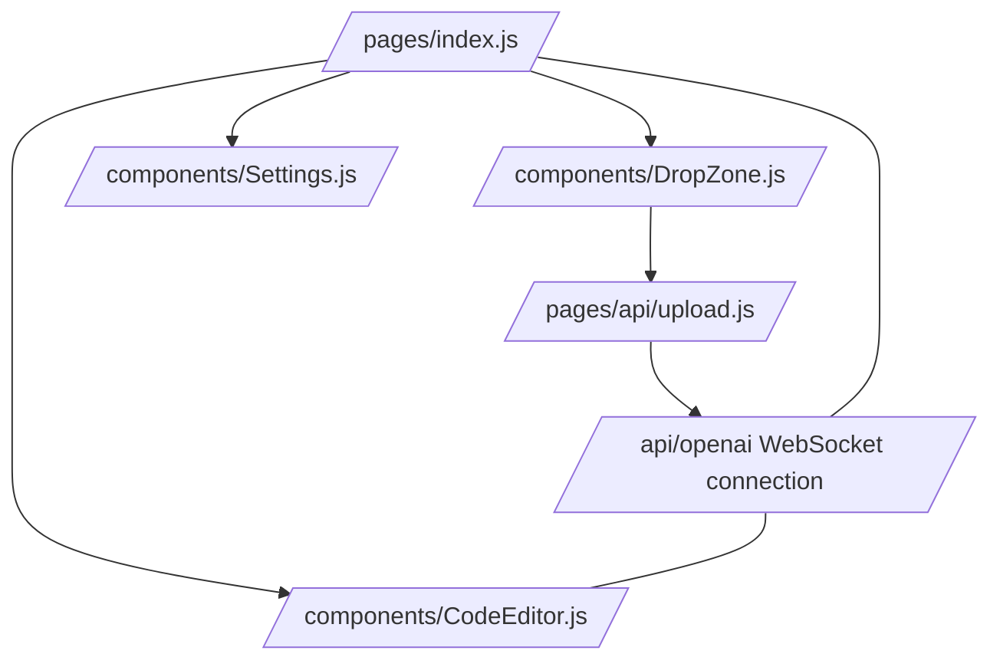

# Project README

## Project Structure

The project is a web application that enables users to upload screenshots and generate daisyUI code based on the uploaded images using OpenAI's API. The application is organized into a main page and several key components that handle different aspects of the application.

### File Paths and Purposes

- **/pages/index.js**
  - The main page of the application.
  - Manages the state for variables such as the OpenAI key, the code to be displayed, loading status, and UI options.
  - Sets up WebSocket to listen to updates from the server when an image is uploaded.
  - Aggregates components like settings, drop zone, and code editor into the UI.

- **/components/DropZone.js**
  - Manages the drag-and-drop upload functionality for images.
  - Sends the uploaded image to the server for processing and listens for a successful response to trigger further actions.
  
- **/components/CodeEditor.js**
  - Displays the generated code with syntax highlighting and line numbers.
  - Allows users to copy the code to the clipboard or view it in a new tab.

- **/components/Settings.js**
  - Provides a UI for users to input and update configuration settings such as API keys.

- **/pages/api/upload.js**
  - An API endpoint that handles the image upload and storage using Vercel's Blob service.
  
- **/pages/api/openai.js**
  - An API endpoint that establishes a WebSocket connection and communicates with OpenAI's API using the uploaded image data.

- **/prompts/daisyUI**
  - Contains predefined rules and scripts to instruct the OpenAI model on how to generate the code that adheres to the project's specifications.

## Features

- Image upload with drag-and-drop functionality.
- Real-time code generation based on an uploaded image.
- WebSocket communication for streaming OpenAI responses.
- Syntax-highlighted code editor.
- Code copying and previewing in a new tab.
- User settings for configuring API keys.

## Data Flow

1. A user uploads an image via the `DropZone` component.
2. The image is sent to the `/api/upload` endpoint where it is stored.
3. Upon a successful upload, a WebSocket connection is opened by calling the `onUploadSuccess` function.
4. The server-side handler for `/api/openai` initiates AI processing and streams back the generated code via WebSocket.
5. The `CodeEditor` component updates to display the new code with syntax highlights.

## User Flow

1. The user visits the main page (`index.js`) and is presented with options to upload an image and view/update settings.
2. Once the image is uploaded and processed, the user can interact with the `CodeEditor` to copy or preview the code.
3. Settings can be changed at any time via the `Settings` component.

## Organization

The application is split into reusable components (`DropZone`, `CodeEditor`, and `Settings`), which are then imported and used in the `index.js` page. API endpoints (`upload.js` and `openai.js`) are kept separate as serverless functions.

## Mermaid Scheme

